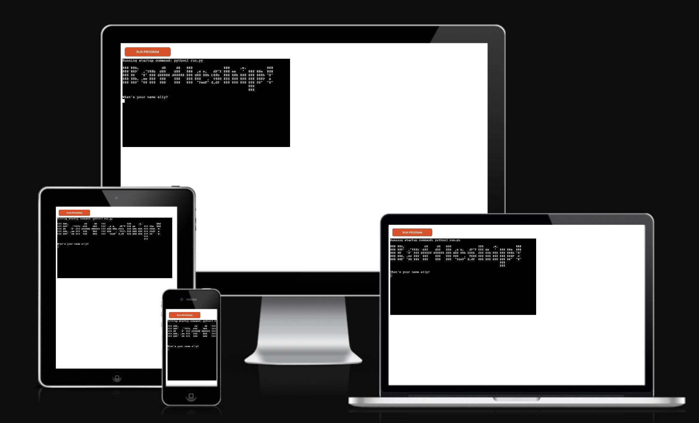
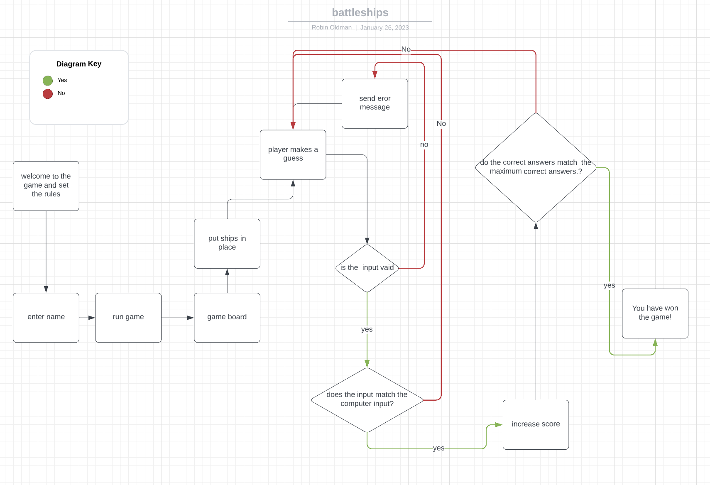
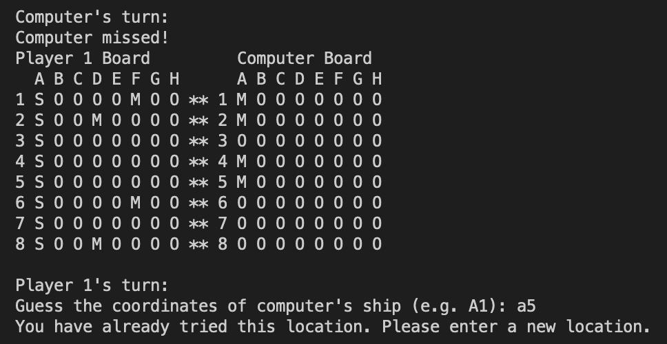
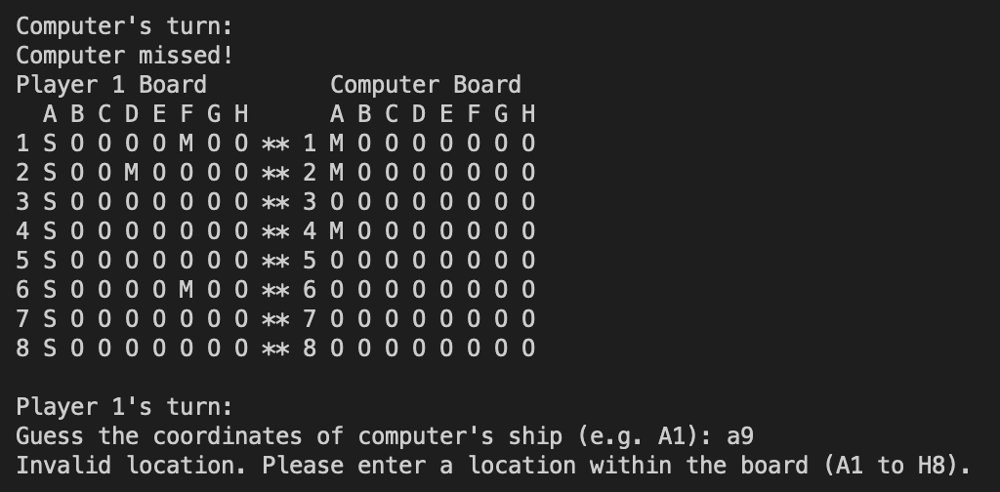
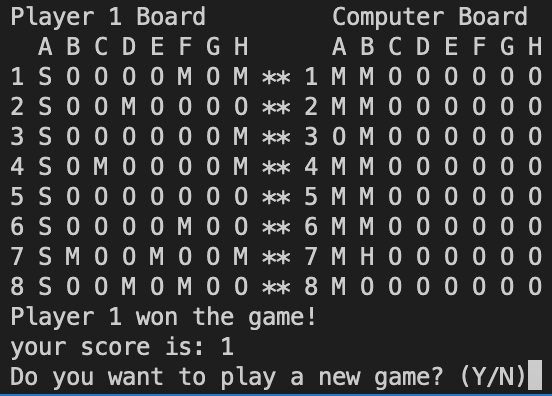

BattleshipsGame - ReadMe
Introduction

This code is a simple implementation of the game Battleships. The code creates two 8x8 boards and allows player 1 to add ships to their board. The computer then randomly places ships on its board. The game is then played turn by turn until the criteria for game over are met. After the game is over, the player is asked if they want to play again. If yes, the game runs again, otherwise, the program exits.

Program Organisation

The program is organized in the following manner to improve readability:

    Import statements
    Global constants and variables in that order
    Function definitions
        The main function should be the last function defined, and should be the entry point into the program
        To avoid having any naked code (code not inside a function), it should be moved into the main function.
    Main function call

Code Execution

The code creates two 8x8 boards and initializes each grid with the value "O" indicating that it is unoccupied. Player 1 is asked to add ships to their board and the computer places ships on its board. The game then runs turn by turn until the criteria for game over are met. After the game is over, the player is asked if they want to play again. If yes, the game runs again, otherwise, the program exits.

Flowchart

I initially created a flowchart with the basic steps that the program needed to take for it to function. 

Welcome Screen
        In this feature the user is greeted and welcomed to the game, they are prompted to enter their name and start the gmae. I used slow type to add dramtic effect to ther experience. The player is then told the rules of the game.

Gameboard
        The gameboard shows both the computer and the player's boards.  It will display M's for misses and a S for ships and H's for a hit.

Gameboard

    Row and Column User Input Request
        The user input request occurs once the welcome screen has appeared. Here the program asks the user to input the row and column coordinates to the cell in the board where their boats will be placed

User Input Request

    
        This message shows that a co ordinate has already been chosen

        this message shownc that a co ordinate is out of range

        this message shows that a co ordinate is not a valid character

Missile Count/Hit or Miss Message

    Win or Lose Message and Option to End Program or Play Again
        once a game has been won or lost the player is able to choose if they would like to play another game or quit. at which point they are able to exit.

There is something I would change if I had more time.

    emojis for thhe ships and missed
        This would give a better user experince and make the game more attractive to play
    

Tools & Technologies Used

For this program I used the technologies listed below:

    Diagrams.net used for logic design process.
    Python used as the back-end programming language.
    Git used for version control. (git add, git commit, git push)
    GitHub used for secure online code storage.
    Gitpod used as a cloud-based IDE for development.
    Heroku used for hosting the deployed back-end site.
   

Data Model
Flowchart

I used a flowchart to create the app's logic, and mapped out before coding began 

Here is the flowchart.

The primary functions and methods I used are:

    def clear_screen():
        clears screen

    def print_boards(board_1, board_2):
        creates 2 boards to play on 

    def add_ship(board_1, x, y):
        sets the value of the grid in the board at the coordinates x,y to "S"
    
    def place_computer_ships(board_2, ship_locations):
        Uses a while loop to run until the count of ships placed on the board is equal to 8.
    
    print_boards(board_1, board_2)
        prints 2 playing boards
    
    def play_game():
        infinite loop that alternates between the player and computer 
        until either the player or the computer wins the game.

     
Imports

I've used the following Python imported packages.

    os: used for adding a clear() function.
    random: used to get a random choice from a list.

Testing

| test description              	| issue                                                                                                                                            	| pass 	|
|-------------------------------	|--------------------------------------------------------------------------------------------------------------------------------------------------	|------	|
| clear screen                  	| Call the clear_screen function and verify that it clears the terminal screen.                                                                    	| yes  	|
| board view                    	| Call the print_boards function with the two boards as arguments and  verify that it prints the two boards in the correct format with values of O 	| yes  	|
| ship selection                	| player 1's ships change to 's' when seleced                                                                                                      	| yes  	|
| ship recognition              	| computer recognises where the hidden ships in the computer board are                                                                             	| yes  	|
| board change for hit and miss 	| the board changes with a H and and a M when ships have been missed and hit                                                                       	| yes  	|
| ships placed on board         	| computer places 8 ships on the board                                                                                                             	| yes  	|
| wrong input                   	| error message for wrong input                                                                                                                    	| yes  	|
| wrong range                   	| error message for input out of range                                                                                                             	| yes  	|
| repetition of coordinates     	| error message for input already selected                                                                                                         	| yes  	|
| feedback for hit and miss     	| message come up for hit and miss                                                                                                                 	| yes  	|
| score update                  	| the score updates when a game has been won by the computer or player                                                                             	| yes  	|
| end game                      	| after game won player presses any button and whole game ends                                                                                     	| yes  	|
| loop back for new game        	| winning messgae for win loops back to start when y is pressed                                                                                    	| yes  	|

The live deployed application can be found deployed on Heroku.

Deployment steps are as follows, after account setup:

    Select New in the top-right corner of your Heroku Dashboard, and select Create new app from the dropdown menu.
    Your app name must be unique, and then choose a region closest to you (EU or USA), and finally, select Create App.
    From the new app Settings, click Reveal Config Vars, and set the value of KEY to PORT, and the value to 8000 then select add.
    If using any confidential credentials, such as CREDS.JSON, then these should be pasted in the Config Variables as well. No confidential credentials were used for this program hence no CREDS.JSON file was needed.
    Further down, to support dependencies, select Add Buildpack.
    The order of the buildpacks is important, select Python first, then Node.js second. (if they are not in this order, you can drag them to rearrange them)
    On the Deploy tab, click on the Enable Automatic Deploys to allow dynamic App update after every GitHub push. Please note that on the screenshot it shows Disable Automatic Deploys because the app had already been deployed when screenshot was taken.
    Further down, to execute the deployment and connect your own GitHub repository to the newly created app, click on Deploy Branch
    Finally once Heroku finishes building the App, click on Open App to see the App deployed.

Deployment

How to set up HEROKU 

Install the Heroku CLI: The Heroku Command Line Interface (CLI) allows you to manage your Heroku apps from the terminal. You can download the CLI from the Heroku website.

Create a new app: Use the Heroku CLI to create a new app in your account. This can be done with the following command: heroku create. This will create a new app and add a git remote to your local repository.

Prepare your app for deployment: You will need to make sure your application is ready for deployment to Heroku. This may include things like configuring your database, setting up environment variables, and making sure your application is listening on the correct port.

Deploy your app: Once your app is ready for deployment, you can push your code to Heroku using git. You can do this with the following command: git push heroku main (assuming you're pushing from the main branch).

To commit and push code from a local filesystem to Github and Heroku, you can follow these steps:

Create a local Git repository: Initialize a Git repository in your local project directory using the git init command.

Create a remote repository: Create a new repository on Github and connect it to your local repository using the git remote add origin command. This sets up a connection between your local repository and your Github repository.

Add and commit your code: Use the git add command to stage your changes and then use the git commit command to commit your changes to the local repository.

Push changes to Github: Use the git push command to push your local changes to the Github remote repository.

Connect Github to Heroku: Connect your Github repository to your Heroku application using the Heroku Dashboard or the Heroku CLI. This can be done by specifying the Github repository and branch to deploy.

Deploy your application: Once the connection is established, you can deploy your application to Heroku by either manually triggering a deploy or by configuring Heroku to automatically deploy new changes.

Heroku uses a Continuous Deployment (CD) process to automatically pick up changes from a connected Github repository. This CD process can be configured to automatically deploy changes to a Heroku application when new code is pushed to a specified branch on the Github repository. When a new push is made to the specified branch, Heroku automatically pulls the changes, builds and deploys the application to the specified Heroku environment.

In summary, by setting up a remote repository on Github, connecting it to your Heroku application, and configuring a Continuous Deployment (CD) process, you can automate the process of deploying your code changes to Heroku.

You can install this project's requirements (where applicable) using:

    pip3 install -r requirements.txt 

If you have your own packages that have been installed, then the requirements file needs updated using:

    pip3 freeze --local > requirements.txt

The Procfile can be created with the following command:

    echo web: node index.js > Procfile

Local Deployment

You can clone or fork this project in order to make a local copy on your own system.

Install any applicable packages found within the requirements.txt file.

    pip3 install -r requirements.txt.

Cloning

You can clone the repository by following these steps:

    Go to the GitHub repository
    Locate the Code button above the list of files and click it
    Select if you prefer to clone using HTTPS, SSH, or GitHub CLI and click the copy button to copy the URL to your clipboard
    Open Git Bash or Terminal
    Change the current working directory to the one where you want the cloned directory
    In your IDE Terminal, type the following command to clone my repository:
        git clone https://github.com/robinoldman/battleships
    Press Enter to create your local clone.

FORKING

Forking the GitHub Repository

By forking the GitHub Repository, you can make a copy of the original repository in your own GitHub account. This means we can view or make changes without making the changes affecting the original.

Log into GitHub and locate the GitHub Repository. At the top of the Repository there is a "Fork" button about the "Settings" button on the menu. You should now have a new copy of the original repository in your own GitHub account.

ACKNOWLEDGMENTS

My mentor Brian Macharia helped me through many issues and hurdles along the way with expert advice on my CSS and HTML. My Brother Patrick Oldman also supported me and recommended tutorials to watch online to help with any issues.
Disclaimer

The content of this Website is for educational purposes only.
