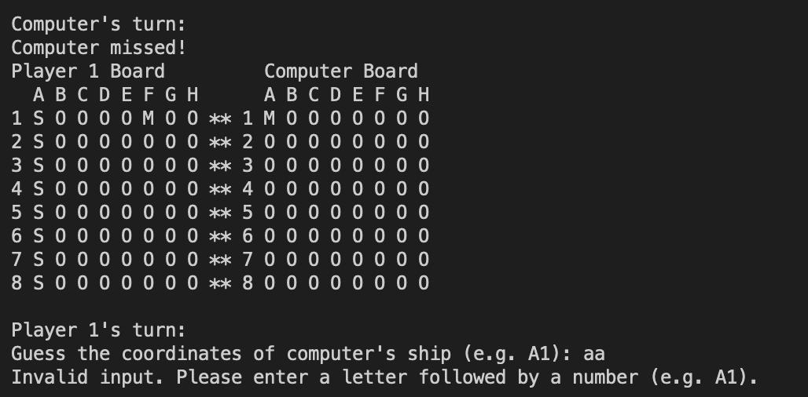

BattleshipsGame - ReadMe
Introduction

This code is a simple implementation of the game Battleships. The code creates two 8x8 boards and allows player 1 to add ships to their board. The computer then randomly places ships on its board. The game is then played turn by turn until the criteria for game over are met. After the game is over, the player is asked if they want to play again. If yes, the game runs again, otherwise, the program exits.

Program Organisation

The program is organized in the following manner to improve readability:

    Import statements
    Global constants and variables in that order
    Function definitions
        The main function should be the last function defined, and should be the entry point into the program
        To avoid having any naked code (code not inside a function), it should be moved into the main function.
    Main function call

Code Execution

The code creates two 8x8 boards and initializes each grid with the value "O" indicating that it is unoccupied. Player 1 is asked to add ships to their board and the computer places ships on its board. The game then runs turn by turn until the criteria for game over are met. After the game is over, the player is asked if they want to play again. If yes, the game runs again, otherwise, the program exits.

Flowchart

I initially created a flowchart with the basic steps that the program needed to take for it to function. 

Welcome Screen
        In this feature the user is greeted and welcomed to the game, they are prompted to enter their name and start the gmae. I used slow type to add dramtic effect to ther experience. 

Gameboard
        The gameboard shows both the computer and the player's boards.  It will display M's for misses and a S for ships and H's for a hit.

Gameboard

    Row and Column User Input Request
        The user input request occurs once the welcome screen has appeared. Here the program asks the user to input the row and column coordinates to the cell in the board where their boats will be placed

User Input Request

    
        This message shows that a co ordinate has already been chosen

        this message shownc that a co ordinate is out of range

        this message shows that a co ordinate is not a valid character

Missile Count/Hit or Miss Message

    Win or Lose Message and Option to End Program or Play Again
        once a game has been won or lost the player is able to choose if they would like to play another game or quit. at which point they are able to exit.

There is something I would change if I had more time.

    emojis for thhe ships and missed
        This would give a better user experince and make the game more attractive to play
    

Tools & Technologies Used

For this program I used the technologies listed below:

    Diagrams.net used for logic design process.
    Python used as the back-end programming language.
    Git used for version control. (git add, git commit, git push)
    GitHub used for secure online code storage.
    Gitpod used as a cloud-based IDE for development.
    Heroku used for hosting the deployed back-end site.
   

Data Model
Flowchart

I used a flowchart to create the app's logic, and mapped out before coding began 

Here is the flowchart.

The primary functions and methods I used are:

    clear()
        Clears the screen when necessary to create space for new printouts.
    convert_letters_to_numbers()
        Retrieves the corresponding number to the letter the user will input.
    print_board(self)
        Prints an eight by eight user board grid.
    create_ships(self)
        Creates the five computer's hidden battleships in random positions in the board.
    get_user_input(self)
        Requests and returns the user's inputs for row and column, it also handles errors when user input not in range.
    intro_to_game(self)
        Requests and returns the user's input to select whether they want to read the rules and start the game or simply start the game, it also handles errors when user input not in range.
    count_destroyed_ships(self)
        Counts how many of the computer's hidden battleships have been hit by the user.
    print_intro()
        Prints the welcome message to the user and offers them the options from intro_to game method.
    print_rules()
        Prints the game rules should the user chooses to do so.
    play_again_option()
        Asks the user once they've finished the game whether they want to play again or end the program.
    run_game()
        Executes the main logic of the game.

Imports

I've used the following Python packages and/or external imported packages.

    os: used for adding a clear() function.
    random: used to get a random choice from a list.

Testing
look at testing in the TESTING.md file.

The live deployed application can be found deployed on Heroku.

Deployment steps are as follows, after account setup:

    Select New in the top-right corner of your Heroku Dashboard, and select Create new app from the dropdown menu.
    Your app name must be unique, and then choose a region closest to you (EU or USA), and finally, select Create App.
    From the new app Settings, click Reveal Config Vars, and set the value of KEY to PORT, and the value to 8000 then select add.
    If using any confidential credentials, such as CREDS.JSON, then these should be pasted in the Config Variables as well. No confidential credentials were used for this program hence no CREDS.JSON file was needed.
    Further down, to support dependencies, select Add Buildpack.
    The order of the buildpacks is important, select Python first, then Node.js second. (if they are not in this order, you can drag them to rearrange them)
    On the Deploy tab, click on the Enable Automatic Deploys to allow dynamic App update after every GitHub push. Please note that on the screenshot it shows Disable Automatic Deploys because the app had already been deployed when screenshot was taken.
    Further down, to execute the deployment and connect your own GitHub repository to the newly created app, click on Deploy Branch
    Finally once Heroku finishes building the App, click on Open App to see the App deployed.

Deployment

Heroku needs two additional files in order to deploy properly.

    requirements.txt
    Procfile

You can install this project's requirements (where applicable) using:

    pip3 install -r requirements.txt 

If you have your own packages that have been installed, then the requirements file needs updated using:

    pip3 freeze --local > requirements.txt

The Procfile can be created with the following command:

    echo web: node index.js > Procfile

Local Deployment

This project can be cloned or forked in order to make a local copy on your own system.

For either method, you will need to install any applicable packages found within the requirements.txt file.

    pip3 install -r requirements.txt.

If using any confidential credentials, such as CREDS.json or env.py data, these will need to be manually added to your own newly created project as well.
Cloning

You can clone the repository by following these steps:

    Go to the GitHub repository
    Locate the Code button above the list of files and click it
    Select if you prefer to clone using HTTPS, SSH, or GitHub CLI and click the copy button to copy the URL to your clipboard
    Open Git Bash or Terminal
    Change the current working directory to the one where you want the cloned directory
    In your IDE Terminal, type the following command to clone my repository:
        git clone https://github.com/leonardo-simeone/command-line-python-battleship-game.git
    Press Enter to create your local clone.

Alternatively, if using Gitpod, you can click below to create your own workspace using this repository.

Forking

By forking the GitHub Repository, we make a copy of the original repository on our GitHub account to view and/or make changes without affecting the original owner's repository. You can fork this repository by using the following steps:

    Log in to GitHub and locate the GitHub Repository
    At the top of the Repository (not top of page) just above the "Settings" Button on the menu, locate the "Fork" Button.
    Once clicked, you should now have a copy of the original repository in your own GitHub account!

Local VS Deployment

The local program performance is optimal as well as the deployed version, the only significant difference as stated in the TESTING.md file more specifically in the Unfixed Bugs section is that in the local version the screen clears completetly after the clear() function is called whereas in the deployed version when you scroll up, a "residue" from the "Rules" print out can be seen.
Credits

Acknowledgements

    I would like to thank my Code Institute mentor,  for his fantastic support throughout the development of this project, for going the extra mile to be as approachable and understanding as humanly possible.
    I would like to thank the Code Institute Slack community for the moral support; as well as my fellow students for the constant feedback and support.
    I would like to thank my wife Amanda, for believing in me, and supporting me unconditionally.
